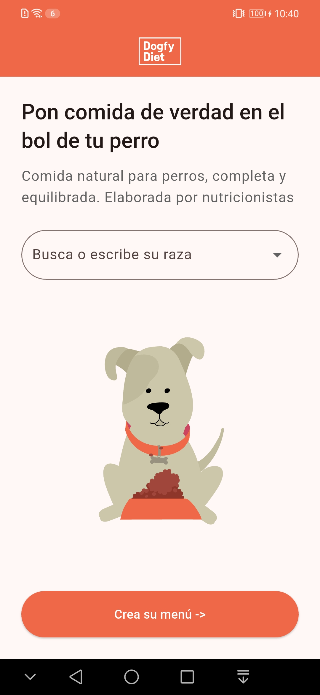
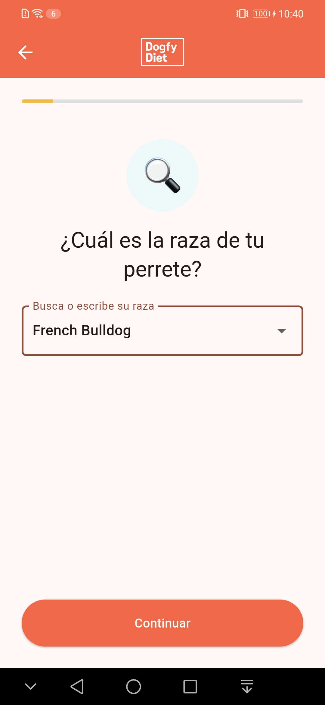
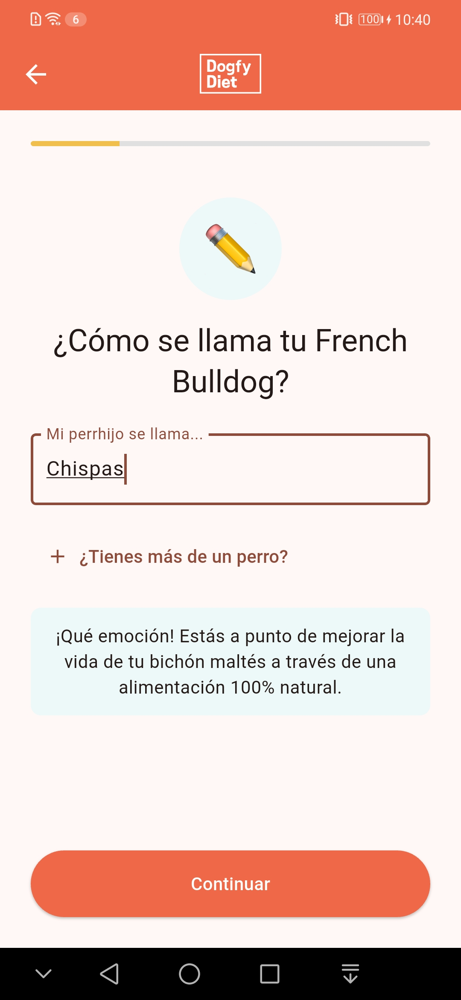
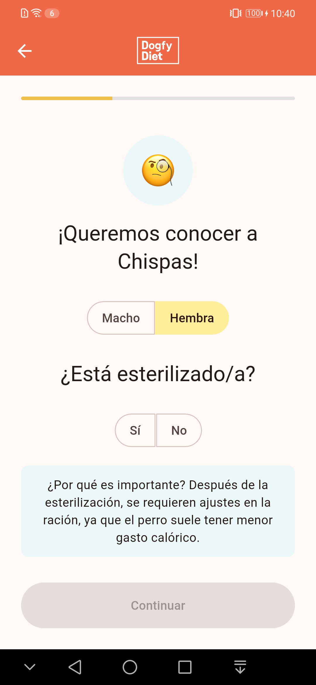
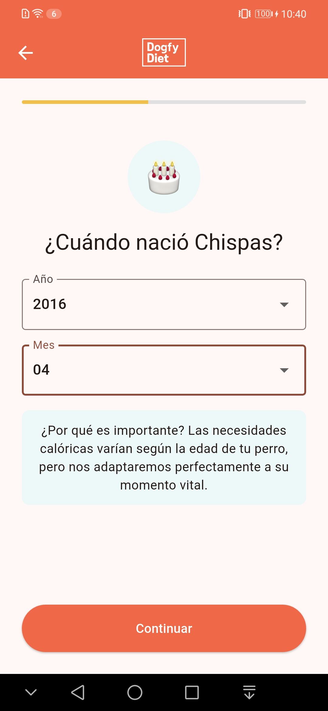
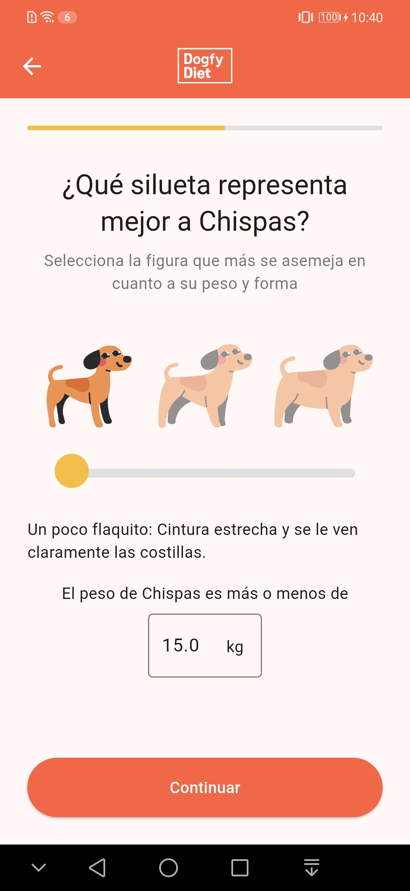
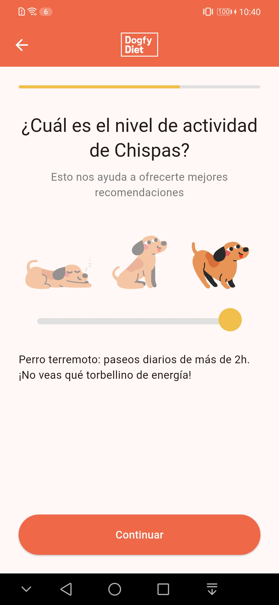
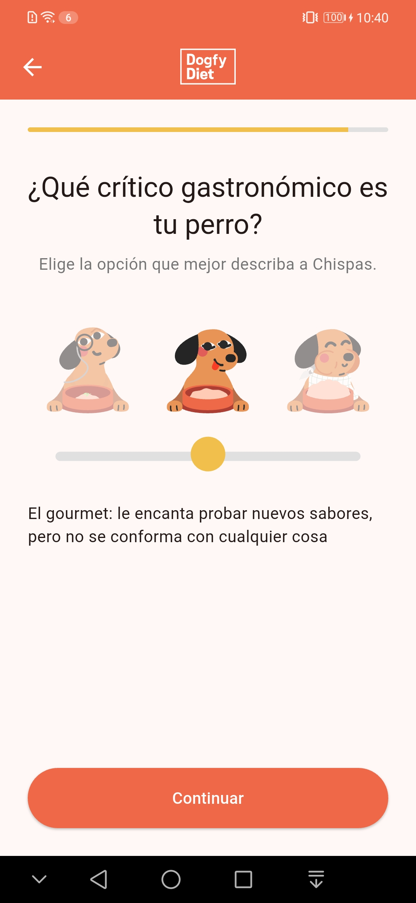
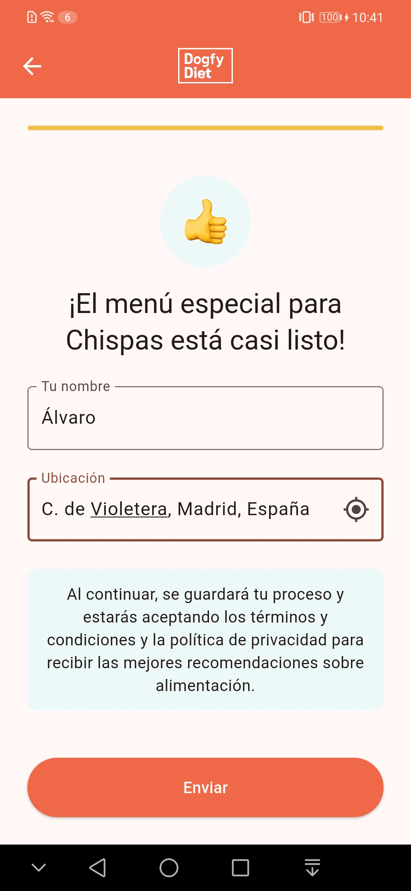

### Ejecución local en emulador o dispositivo
>Nota: Solo se ha probado en dispositivos Android
Sigue estos pasos para ejecutar la app en tu entorno local:

1. **Requisitos previos**
	- Tener instalado [Flutter](https://docs.flutter.dev/get-started/install) (SDK 3.8.0 o superior).
	- Tener instalado Android Studio, VS Code o Xcode (para iOS).
	- Tener configurado un emulador Android/iOS o un dispositivo físico conectado.
	- (Opcional) Instalar las extensiones recomendadas de Flutter y Dart en tu editor.

2. **Clona el repositorio**
	```bash
	git clone https://github.com/alvaroluca/DogfyDiet.git
	```

3. **Instala las dependencias**
	```bash
	flutter pub get
	```

4. **(Opcional) Genera archivos de código**
	Si modificas modelos Freezed, ARB de localización o generadores, ejecuta:
	```bash
	flutter pub run build_runner build --delete-conflicting-outputs

	flutter gen-l10n
	```

5. **Configura un emulador o conecta un dispositivo**
	- Abre un emulador Android/iOS desde tu IDE o conecta un dispositivo físico por USB.

6. **Ejecuta la app**
	```bash
	flutter run
	```
	Esto compilará y lanzará la app en el emulador/dispositivo conectado.

#### Configuración recomendada para launch.json (VS Code)

El archivo `.vscode/launch.json` está preparado para lanzar la app en diferentes modos (`debug`, `profile`, `release`).
Tienes configuraciones predefinidas para cada combinación, facilitando el desarrollo y las pruebas.

```jsonc
{
	"version": "0.2.0",
	"configurations": [
		{
			"name": "Dogfy Diet (debug)",
			"request": "launch",
			"type": "dart",
			"program": "${workspaceFolder}/lib/main.dart",
			"flutterMode": "debug"
		},
		{
			"name": "Dogfy Diet (profile)",
			"request": "launch",
			"type": "dart",
			"program": "${workspaceFolder}/lib/main.dart",
			"flutterMode": "profile"
		},
		{
			"name": "Dogfy Diet (release)",
			"request": "launch",
			"type": "dart",
			"program": "${workspaceFolder}/lib/main.dart",
			"flutterMode": "release"
		}
	]
}
```
Puedes seleccionar cualquiera de estas configuraciones desde el menú de ejecución de VS Code para lanzar la app en el modo y entorno deseado.


### Cómo ejecutar los tests

Puedes ejecutar los tests unitarios y de widgets con los siguientes comandos desde la raíz del proyecto:

**1. Ejecutar todos los tests:**
```bash
flutter test
```
Esto ejecuta todos los tests unitarios y de widgets definidos en la carpeta `test/`.

**2. Ejecutar tests de un archivo concreto:**
```bash
flutter test test/features/onboarding/presentation/steps/dog_name_step_test.dart
```

**3. Ver la cobertura de tests:**
```bash
flutter test --coverage
```
Esto genera un informe de cobertura en `coverage/lcov.info`.

**4. Formatear el código antes de testear (opcional):**
```bash
dart format .
```

**Notas:**
- Los tests están organizados por dominio y tipo en la carpeta `test/`.
- Puedes usar extensiones de VS Code para lanzar tests individuales desde el editor.


## 📁 Estructura de carpetas detallada

| Carpeta/Archivo                                                      | Descripción breve                                                      |
|----------------------------------------------------------------------|------------------------------------------------------------------------|
| lib/                                                                 | Código fuente principal de la app.                                     |
| ├─ app/                                                              | Configuración global, rutas, localización, temas, DI, tipos.           |
| │   ├─ config/                                                       | Temas, helpers y configuración global.                                 |
| │   ├─ constants/                                                    | Constantes globales.                                                   |
| │   ├─ di/                                                           | Inyección de dependencias (get_it).                                    |
| │   ├─ l10n/                                                         | Archivos y generación de localización.                                 |
| │   ├─ routes/                                                       | Definición de rutas y navegación (GoRouter).                           |
| │   ├─ types/                                                        | Tipos y enums globales.                                                |
| ├─ features/                                                         | Features principales (onboarding, home, etc).                          |
| │   ├─ home/                                                         | Lógica y UI de la pantalla principal.                                  |
| │   │   ├─ presentation/pages/                                       | Páginas principales de home.                                           |
| │   │   ├─ presentation/widgets/                                     | Widgets específicos de home.                                           |
| │   ├─ onboarding/                                                   | Lógica y UI del flujo de onboarding.                                   |
| │   │   ├─ data/                                                     | Datasources y repositorios propios de onboarding.                      |
| │   │   ├─ domain/                                                   | Entidades, repositorios y usecases de onboarding.                      |
| │   │   ├─ presentation/pages/                                       | Página principal de onboarding.                                        |
| │   │   ├─ presentation/steps/                                       | Steps/widgets del flujo de onboarding.                                 |
| │   │   ├─ presentation/steps/cubit/                                 | Cubits específicos de cada step.                                       |
| │   │   ├─ presentation/cubit/                                       | Cubits generales de onboarding.                                        |
| │   │   ├─ presentation/widgets/                                     | Widgets reutilizables de onboarding.                                   |
| ├─ shared/                                                           | Código y recursos reutilizables entre features.                        |
| │   ├─ bloc/                                                         | Blocs/cubits compartidos 												|
| │   ├─ data/                                                         | Modelos, repositorios y datasources compartidos.                       |
| │   ├─ domain/                                                       | Entidades, repositorios y usecases compartidos.                        |
| │   ├─ widgets/                                                      | Widgets reutilizables globalmente.                                     |
| test/                                                                | Tests unitarios, de widgets y de integración.                          |
| ├─ features/                                                         | Tests organizados por feature.                                         |
| │   ├─ home/                                                         | Tests de home.                                                         |
| │   ├─ onboarding/                                                   | Tests de onboarding (steps, cubits, etc).                              |
| ├─ shared/                                                           | Tests de lógica/modelos compartidos.                                   |
| ├─ utils/                                                            | Helpers y utilidades para tests.                                       |
| assets/                                                              | Recursos estáticos: imágenes, iconos, lotties, mocks.                  |
| ├─ icons/                                                            | Iconos de la app.                                                      |
| ├─ images/                                                           | Imágenes estáticas.                                                    |
| ├─ lotties/                                                          | Animaciones Lottie.                                                    |
| ├─ mocks/                                                            | Datos de ejemplo y mocks para tests/desarrollo.                        |
| .vscode/                                                             | Configuración de VS Code (launch.json, etc).                           |
| screenshots/                                                         | Capturas de pantalla y grabaciones de la app.                          |
| pubspec.yaml                                                         | Configuración de dependencias y assets de Flutter.                     |
| README.md                                                            | Documentación principal del proyecto.                                  |

## 🏗️ Arquitectura y decisiones de diseño
Este proyecto sigue los principios de **Clean Architecture** y DDD (Domain-Driven Design) para garantizar mantenibilidad, escalabilidad y testabilidad. Las principales decisiones y patrones son:

- **Separación por capas:**
	- `lib/app/`: Configuración global, rutas, localización, DI, temas, tipos y constantes.
	- `lib/features/`: Features de la app (onboarding, home, etc.), cada una con sus propias capas internas de data/domain/presentation.
	- `lib/shared/`: Código compartido entre features (bloc/cubits, modelos, repositorios, datasources, entidades, usecases y widgets reutilizables).

- **Gestión de estado:**
	- Uso de **Bloc/Cubit** (flutter_bloc) para aislar la lógica de negocio de la UI.
	- Estados y eventos modelados con **Freezed** para inmutabilidad y exhaustividad.

- **Navegación:**
	- **GoRouter** para rutas declarativas y navegación robusta.

- **Internacionalización:**
	- Soporte multilenguaje con ARB y generación automática (`gen-l10n`).
    - Por defecto está en español. Para usar el idioma del dispositivo hay que quitar la siguiente línea de `main.dart` 
    ```bash
    locale: state.locale,
    ```

- **Persistencia local:**
	- **SharedPreferences** para guardar el progreso del onboarding y preferencias.

- **Inyección de dependencias:**
	- **get_it** para desacoplar la creación de objetos y facilitar el testeo.

- **Tests:**
	- Tests unitarios, de widgets y de integración, organizados por dominio y feature.

Esta estructura permite que cada capa evolucione de forma independiente y que la lógica de negocio sea fácilmente testeable y reutilizable.

## 📸 Screenshots y grabaciones











